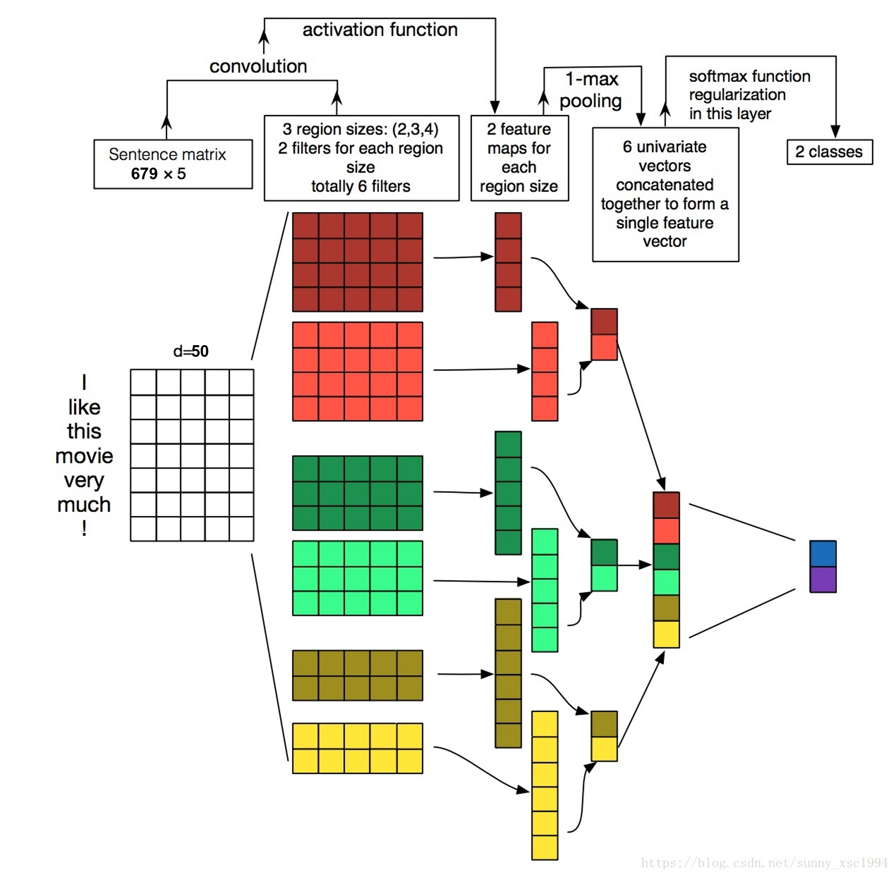

# 实验报告——情感分析

##### 张天乐 计96 2018011038

### 1.模型的结构图， 以及流程分析。

#### 1.1 MLP

如图所示，每个句子所含的词数量不同，经统计最长的句子词数为679。因此首先将句子填充到同样长度，即679个词。每个词对应一个长度50的一维词向量，将词拼接成长度670*50的一维向量，该向量即为神经网络的输入`input`。

隐含层有16个神经元，使用ReLU激活函数。输出层有2个神经元，使用ReLU激活函数。

#### 1.2 CNN

模型的结构和课件中TextCNN一模一样。对于输入的句子，做0填充到679长度。每个词为长度50的一维向量。

模型有3个一维卷积核，输入通道`in_channels=50`，输出通道`out_channels=2`，`kernel_size`分别是`(2,3,4)`。还有一个全连接层，输入通道6，输出通道2。

`input`是`[50, 679]`的向量，表示`input`有50个通道，每个通道是679长度的一维向量。`input`通过三个卷积后得到3个输出，输出size是`[2, 678], [2, 677], [2, 676]`，2表示是两个通道。将输出做1-最大池化后拼接在一起，得到一个长度为6的一维向量。然后连接到全连接层，得到2个数值的输出。

#### 1.3 RNN

RNN使用的是双层双向LSTM网络，结构如图。输入x是含有n个词的句子，每个词是长为50的一维向量。LSTM的`hidden_size=16`，也就是状态`h`是长为16的向量。

输入经过LSTM处理后，获取`h[2], h[3]`。因为隐藏层很好的表达了整个句子的信息，双向LSTM同时得到了正向读句子时的信息结果和反向读句子时的信息结果。因此使用`h[2], h[3]`既简洁又高效。

将`h[2], h[3]`拼接成长度32的向量，再经过一个全连接网络，获得输出。

    
    

### 2.实验结果，准确率， F-score

|      | Accuracy | F-score |
| ---- | -------- | ------- |
| MLP  | 0.7425   | 0.7309  |
| CNN  | 0.7832   | 0.7895  |
| RNN  | 0.8320   | 0.8297  |

### 3.试简要地比较实验中使用的不同参数效果，并分析原因。

#### 3.1 learning rate

实验中，我亲身体验到 learning rate 以及 schedule 对模型的收敛速度有很大的影响。

下图分别是`lr=0.001, optimizer使用SGD, schedule使用LambdaLR` 和 `optimizer使用AdamW, schedule使用CyclicLR, max_lr, base_lr = 0.0013, 0.00026`两种方案的训练过程。

可以看到第二种方案非常快的收敛，而第一种方案收敛的非常慢

    
    

#### 3.2 batch

在GPU和内存允许的范围内，将batch越大，训练速度会更快。然而，使用大batch的不足是，这可能导致解决方案的泛化能力比使用小batch的差。

### 4.比较MLP, CNN, RNN 模型的效果差异

MLP, CNN, RNN模型的训练过程如下。其中横轴表示训练的样本数量，纵轴表示交叉熵损失函数以及验证集准确率。

可以看到准确率$RNN>CNN>MLP$。迭代速度$MLP>CNN>RNN$。我认为原因是`MLP`模型简单，所以迭代速度最快。但简单的模型限制了其最终效果并不好。`RNN`模型是最复杂的，同时也是最贴合情感分类问题的。因此`RNN`的迭代速度稍慢，但最终效果是最好的。

同时，我们可以在图中看到，`MLP`和`RNN`的`valid loss`都要高于`train loss`，说明模型有过拟合问题。`CNN`则没有。我已经在训练过程中加入了early stopping, dropout和正则化方法，但还是有一定的过拟合现象。这个问题有待改进。

    
    
    

### 5.问题思考

#### 1） 实验训练什么时候停止是最合适的？ 简要陈述你的实现方式， 并试分析固定迭代次数与通过验证集调整等方法的优缺点。

设定一个迭代轮数，然后使用早停法，根据验证集的情况停止。早停法通过验证集调整停止点，可以解决过拟合问题，比固定迭代次数好。比如在上一部分MLP训练过程图片中，我们可以看到：模型在训练样本300000后，训练集损失函数继续下降，但验证集损失不降反增。这说明模型已经产生了过拟合，因此训练停止，将之前性能最好时候的模型参数保存下来。

当我们训练深度学习神经网络的时候通常希望能获得最好的泛化性能。但是所有的标准深度学习神经网络结构如全连接多层感知机都很容易过拟合。早停法是解决过拟合的一个方向。

    

#### 2） 实验参数的初始化是怎么做的？不同的方法适合哪些地方？（现有的初始化方法为零均值初始化， 高斯分布初始化， 正交初始化等）

深度学习中的参数初始化对模型收敛速度和模型质量有重要影响。深度学习模型训练的过程本质是对参数进行更新，这需要每个参数有相应的初始值。如何选择参数初始值便成为一个值得探讨的问题，其本质是初始参数的选择应使得目标函数便于被优化。下面是一些初始化方法的优缺点以及适合的地方。

**0初始化**

0初始化是不可行的。因为如果所有的参数都是0，那么所有神经元的输出都将是相同的。经过正向传播和反向传播后，参数的不同维度之间经过相同的更新，迭代的结果是不同维度的参数是一样的，严重地影响了模型的性能。

**随机数初始化**

将参数初始化为随机数。缺点是如果参数太小，会导致神经元输入过小，经过多层之后信号就慢慢消失，参数过小还会使得sigmoid型函数丢失非线性能力(参考sigmoid函数曲线，在接靠近0的位置接近于线性)。如果参数取得太大，会导致输入状态过大，对于sigmoid型激活函数来说，激活值变得饱和，从而导致梯度接近于0。

**均匀分布初始化**

给定一个区间 [−r,r] 内采用均匀分布初始化参数。超参数r的设置也可以按照神经元的连接数量进行自适应调整。

- Xavier初始法，适用于普通激活函数(tanh,sigmoid)
- He初始化，适用于ReLU

**高斯分布初始化**

参数从一个固定均值和固定方差的Gaussian分布进行随机初始化。

当一个神经元的输入连接数量为$n_{in}$时，可以设置其输入连接权重以$N(0,\sqrt{1/n_{in}})$的Gaussian分布进行初始化。如果同时考虑输出的数量$n_{out}$，可以按$N(0, \sqrt{2/(n_{in}+n_{out})}$的Gaussian分布进行初始化。

- Xavier初始法，适用于普通激活函数 (tanh,sigmoid)
- He初始化，适用于ReLU

#### 3） 过拟合是深度学习常见的问题， 有什么方法可以防止训练过程陷入过拟合。

* 早停法：当模型在验证集上的表现开始下降的时候，停止训练
* 正则化法：损失函数中加入正则化项
* 舍弃法：随机地临时舍弃一些神经元  
* 数据增强法：数据越多，过拟合的风险就越小  

#### 4） 试分析 CNN， RNN，全连接神经网络（ MLP）三者的优缺点。  

MLP：因为句子长度不固定，所以可以简单将词向量相加，或者扩充到同一长度，然后使用MLP。这个方法比较简单，训练速度很快，得到的结果稍差。缺点是没有利用到上下文信息。

CNN：CNN也需要对不等长的句子做一定处理。CNN对输入序列做一维卷积，能获取一定量前后文信息。用最大池化获得最重要的影响因子。但这种方法只选取了一小部分词的信息，不像RNN一样有”记忆“，因此速度和准确率都是中等。

RNN：我觉得RNN在处理语言信息上是最自然的。首先并不需要对句子做处理（相加，截断，扩充）。将句子或文本作为时序序列输入，可以利用到上下文信息。并且LSTM的长短期记忆，以及双向循环网络考虑到正读反读的前后所有文本信息，都提升了RNN模型性能。RNN的准确率是最高的。但RNN的缺点是训练速度很慢。

### 6.实验代码

[dataset](https://cloud.tsinghua.edu.cn/f/d2504baf51b5439e8a7d/)

[models](https://cloud.tsinghua.edu.cn/f/9d6d2f9e71b743afaace/)

[main](https://cloud.tsinghua.edu.cn/f/9d6d2f9e71b743afaace/)
