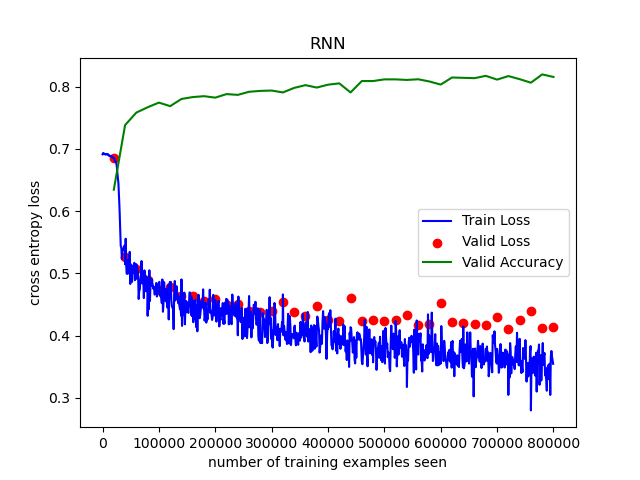
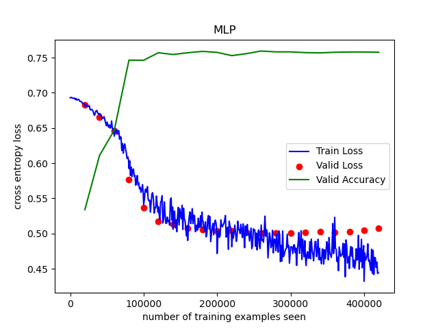
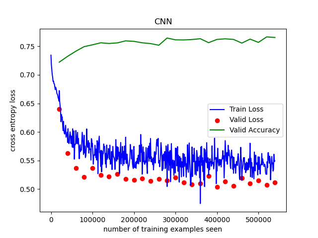

# 实验报告——情感分析

##### 张天乐 计96 2018011038

### 1.模型的结构图， 以及流程分析。

#### 1.1 MLP

如图所示，每个句子所含的词数量不同，经统计最长的句子词数为679。因此首先将句子填充到同样长度，即679个词。每个词对应一个长度50的一维词向量，将词拼接成长度670*50的一维向量，该向量即为神经网络的输入`input`。

隐含层有16个神经元，使用ReLU激活函数。输出层有2个神经元，使用ReLUctant激活函数。

#### 1.2 CNN

模型的结构和课件中TextCNN一模一样。对于输入的句子，做0填充到679长度。每个词为长度50的一维向量。

模型有3个一维卷积核，输入通道`in_channels=50`，输出通道`out_channels=2`，`kernel_size`分别是`(2,3,4)`。还有一个全连接层，输入通道6，输出通道2。

`input`是`[50, 679]`的向量，表示`input`有50个通道，每个通道是679长度的一维向量。`input`通过三个卷积后得到3个输出，输出size是`[2, 678], [2, 677], [2, 676]`，2表示是两个通道。将输出做1-最大池化后拼接在一起，得到一个长度为6的一维向量。然后连接到全连接层，得到2个数值的输出。

#### 1.3 RNN

RNN使用的是双层双向LSTM网络，结构如图。输入x是含有n个词的句子，每个词是长为50的一维向量。LSTM的`hidden_size=16`，也就是状态`h`是长为16的向量。

输入经过LSTM处理后，获取`h[2], h[3]`。因为隐藏层很好的表达了整个句子的信息，双向LSTM同时得到了正向读句子时的信息结果和反向读句子时的信息结果。因此使用`h[2], h[3]`既简洁又高效。

将`h[2], h[3]`拼接成长度32的向量，再经过一个全连接网络，获得输出。

    
    

### 2.实验结果，准确率， F-score

|      | Accuracy | F-score |
| ---- | -------- | ------- |
| MLP  | 0.7425   | 0.7309  |
| CNN  | 0.7832   | 0.7895  |
| RNN  | 0.8320   | 0.8297  |

### 3.试简要地比较实验中使用的不同参数效果，并分析原因。

#### 3.1 learning rate

实验中，我亲身体验到 learning rate 以及 schedule 对模型的收敛速度有很大的影响。

下图分别是`lr=0.001, optimizer使用SGD, schedule使用LambdaLR` 和 `optimizer使用AdamW, schedule使用CyclicLR, max_lr, base_lr = 0.0013, 0.00026`两种方案的训练过程。

可以看到第二种方案非常快的收敛，而第一种方案收敛的非常慢

    
    

#### 3.2 batch

在GPU和内存允许的范围内，将batch越大，训练速度会更快。然而，使用大batch的不足是，这可能导致解决方案的泛化能力比使用小batch的差。

### 4.比较MLP, CNN, RNN 模型的效果差异

MLP, CNN, RNN模型的训练过程如下。其中横轴表示训练的样本数量，纵轴表示交叉熵损失函数以及验证集准确率。

可以看到准确率$RNN>CNN>MLP$。迭代速度$MLP>CNN>RNN$。我认为原因是`MLP`模型简单，所以迭代速度最快。但简单的模型限制了其最终效果并不好。`RNN`模型是最复杂的，同时也是最贴合情感分类问题的。因此`RNN`的迭代速度稍慢，但最终效果是最好的。

同时，我们可以在图中看到，`MLP`和`RNN`的`valid loss`都要高于`train loss`，说明模型有过拟合问题。`CNN`则没有。我已经在训练过程中加入了early stopping, dropout和正则化方法，但还是有一定的过拟合现象。这个问题有待改进。

    
    
    

### 5.问题思考

1） 实验训练什么时候停止是最合适的？ 简要陈述你的实现方式， 并试分析固定迭代次数与通过验证集调整等方法的优缺点。
2） 实验参数的初始化是怎么做的？不同的方法适合哪些地方？（现有的初始化方法为零均值初始化， 高斯分布初始化， 正交初始化等）
3） 过拟合是深度学习常见的问题， 有什么方法可以方式训练过程陷入过拟合。
4） 试分析 CNN， RNN，全连接神经网络（ MLP）三者的优缺点。  

### 6.心得体会  

